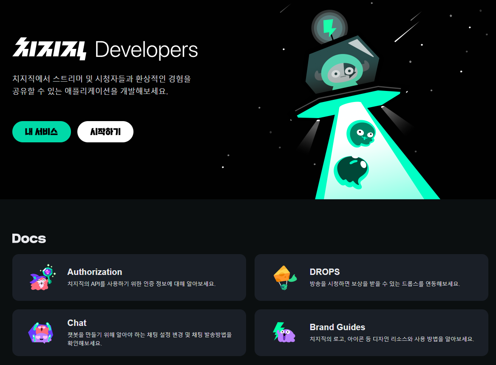
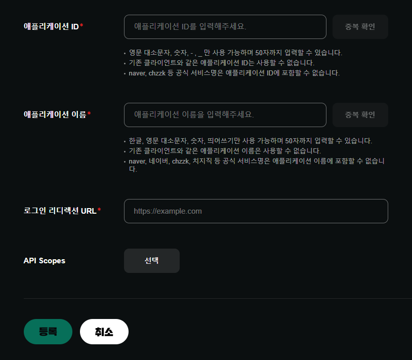

# Cheese Tracker

치지직 후원 이벤트를 실시간으로 기록하고, 후원자별 합계와 최근 내역을 보여주는 Windows 데스크톱 앱입니다.

## 설치와 실행

1. [최신 Release](https://github.com/sys0423/cheese-tracker/releases/latest)에서 `Cheese-Tracker-Setup-*.exe`를 내려받아 설치합니다.
2. 시작 메뉴 또는 바탕화면의 `Cheese Tracker`를 실행합니다.
3. 앱 안에서 Client ID, Client Secret, Redirect URI를 설정하고 치지직 로그인을 완료합니다.
4. 방송 전에 `후원 수집 시작`을 누릅니다.

프로그램을 실행하면 필요한 서버와 앱 창이 자동으로 열립니다. 별도로 PowerShell이나 브라우저를 실행할 필요가 없습니다.

> Windows SmartScreen 경고가 표시될 수 있습니다. 현재 배포본은 코드 서명 인증서가 없는 개인 개발 배포본입니다.

## 치지직 API 앱 만들기

후원을 받는 **각 스트리머가 자기 치지직 Developers 애플리케이션을 만들고**, 발급받은 Client ID와 Client Secret을 자신의 Cheese Tracker에 넣어야 합니다. Client Secret이나 로그인 토큰을 다른 사람에게 전달하지 마세요.

### 1. 치지직 Developers 열기

[치지직 Developers](https://developers.chzzk.naver.com/)에 로그인한 뒤 `시작하기`를 누릅니다.



### 2. 애플리케이션 등록 시작

`애플리케이션 목록` 화면에서 `애플리케이션 등록`을 누릅니다.


### 3. 등록 정보 입력

아래처럼 입력합니다.

| 항목 | 입력값 |
| --- | --- |
| 애플리케이션 ID | 영문, 숫자, `-`, `_`만 사용해 직접 정합니다. 예: `my-cheese-tracker` |
| 애플리케이션 이름 | 알아보기 쉬운 이름을 입력합니다. 예: `나의 Cheese Tracker` |
| 로그인 리디렉션 URL | `http://localhost:5177/oauth/callback` |
| API Scopes | `선택`을 누른 뒤 **후원 조회**를 선택합니다. |

Redirect URI는 위 주소와 **한 글자까지 똑같이** 등록해야 합니다. 특히 `http`, 포트 `5177`, 마지막 `/oauth/callback`을 바꾸면 로그인에 실패합니다.



입력이 끝나면 아래의 `등록`을 누릅니다.

### 4. Client ID와 Client Secret 연결

등록한 애플리케이션의 상세 설정에서 Client ID와 Client Secret을 확인합니다. Cheese Tracker의 설정 화면에 두 값을 붙여 넣고 Redirect URI가 `http://localhost:5177/oauth/callback`인지 확인한 뒤 `설정 저장`을 누릅니다.

그 다음 `치지직 로그인`을 눌러 **방송하는 스트리머 계정**으로 권한을 승인합니다. 로그인이 끝나면 방송 전에 `후원 수집 시작`을 누르세요.

## 동작 방식과 제한

- 치지직 Open API의 실시간 Session 후원 이벤트를 사용합니다.
- 프로그램을 켜고 수집을 시작한 **이후의 후원만** 기록합니다. 과거 후원 내역을 불러오지는 않습니다.
- 프로그램을 종료하면 수집도 멈춥니다.
- 후원 기록은 사용자 PC에만 저장되며 CSV로 내보낼 수 있습니다.

## 자동 업데이트

앱은 실행 시 [GitHub Releases](https://github.com/sys0423/cheese-tracker/releases)에서 새 버전을 확인합니다. 새 버전이 있으면 다운로드와 재시작을 안내합니다.

## 개발과 배포

```powershell
npm install
npm run desktop
```

Windows 설치 파일은 다음 명령으로 만듭니다.

```powershell
npm run dist:win
```

새 버전은 `package.json`의 버전을 올린 뒤 `v1.0.3` 같은 Git 태그를 GitHub에 푸시하면 GitHub Actions가 Release와 업데이트 파일을 자동 생성합니다.
